# SubstingSearchEx

# Содержание

1. [Постановка задачи](#постановка-задачи)

1. [Методика тестирования](#методика-тестирования)

2. [Параметры вычислительного узла](#параметры-вычислительного-узла-на-котором-выполнялось-тестирование)

3. [Описание тестируемых алгоритмов](#краткое-описание-тестируемых-алгоритмов)

4. [Результаты](#результаты-измерений)


# Постановка задачи

Реализовать несколько алгоритмов поиска подстроки в строке и сравнить их по производительности, использованию памяти.

 # Методика тестирования

## Проводимые тесты:

1. Используется короткая подстрока и различные длины текстов.

2. Используется весь текст и подстроки с различными длинами и количеством вхождений.

## Схема использования:

 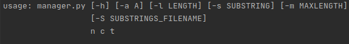
 


 Тестирование производится одной из команд, например:

  - ### Тестирование первой части

 ```bash
 python3 manager.py 1 5 "./data/Texts/Normal/INP_TEXT" -a "bruteforce" -a "boyer_moore_algorithm" -a "prefix_function" -a "rabin_karp_algorithm" -a "z_function" -a "aho_corasick" -m 2 -s rry
 ```
**n** - номер проводимого эксперимента (1);

**c** – количество запусков теста (5);

**FILENAME** – имя файла с текстом, в котором будет проводиться поиск ("./data/Texts/Normal/INP_TEXT");

**A** - название тестируемого алгоритма. Названия перечисляются через `-a` в том виде, в котором они приведены в примере. По умолчанию (без флагов `-a`) тестируется **Build-in find**.

**MAXLENGTH** – 0.01% от максимальной длины текста (2);

**SUBSTRING** – искомая подстрока ("rry");

Этот пакетный файл работает следующим образом: он генерирует числа от 2 до параметра **MAXLENGTH** включительно (если это число четное и исключительно, если оно нечетное) с шагом 2, и умножает число на 5000. Полученное число – количество символов, которые будут прочитаны от начала текста. Затем **`manager.py`** запускает модуль **`src/data_loaders/data_best.py`**, который делит текст и возвращает **list** данных для алгоритма. Результаты тестирования обрабатываются **`src/statiscian/simple_statiscian.py`**. Графики сохраняются в **`results`**.


- ### Тестирование второй части

```bash
 python3 manager.py 2 5 "./data/Texts/Normal/INP_TEXT" -a "bruteforce" -a "boyer_moore_algorithm" -a "prefix_function" -a "rabin_karp_algorithm" -a "z_function" -a "aho_corasick" -l 43000 -S "./data/Texts/Normal/Substrings.txt"
 ```

**n**, **c**, **FILENAME**, **A** аналогично.

**LENGTH** – сколько символов текста нам нужно прочитать от начала;

**SUBSTRINGS_FILENAME** – имя файла с подстроками, поиск которых будет осуществлен.

Этот пакетный файл работает следующим образом: он считывает из файла **SUBSTRINGS_FILENAME** очередную строку, запоминает число, записанное в начале строки, все остальное (исключая ведущие пробелы) считается подстрокой. Затем для каждой подстроки вычисляется колличество вхождений и ее длина, результат записывается в **`data/Text/Normal/substring_*`** Опять же, если какой-нибудь файл с таким именем уже будет существовать, он будет просто-напросто перезаписан.

# Параметры вычислительного узла, на котором выполнялось тестирование

 - ### Операционная система: 
    - **Ubuntu 20.04.1 LTS (Focal Fossa)**
 - ### Процессор: 
    - **Intel i7-8550U**. 
    - Максимальная тактовая частота с технологией Turbo Boost 4.00 GHz
    - Базовая тактовая частота процессора 1,80 GHz
 - ### Оперативная память 
    - **8 ГБ** встроенной памяти DDR4

Все тесты проводились в отдельном терминале (tty2) вне графических сессий (Wayland/i3) и после перезагрузки компьютера, поэтому нагрузки на процессор, которая могла существенно повлиять на результаты, со стороны других приложений не было.

# Краткое описание тестируемых алгоритмов

## Тестируемые алгоритмы

 - Поиск грубой силой (Bruteforce)
 - Поиск с использованием Hesh-функции:
    - Hesh-функция Рабина-Карпа
 - Поиск с помощью алгоритма Бойера-Мура
 - Поиск с использованием префикс-функции:
    - Алгоритм Кнута-Морриса-Пратта
    - Z-функция
 - Алгоритм Ахо-Корасик

## Оценки сложности алгоритмов взяты с сайтов [e-maxx](https://e-maxx.ru/algo/) + [neerc.ifmo.ru](https://neerc.ifmo.ru/wiki/index.php?title=Поиск_подстроки_в_строке):
 
 - Рабина-Карпа 
    - O(length(t)+length(p))
 - Бойера-Мура 
    - O(length(t)*length(p))
 - Кнута-Морриса-Пратта  
    - O(length(t)+length(p))
 - Z функция
    - O(length(t)+length(p))
 - Ахо-Корасик 
    - Препроцессинг O(length(p)) и O(length(t)) на один запрос.
 - Bruteforce 
    - O(length(t)*length(p))

 Все модули, реализующие алгоритмы, состоят из следующих частей, например, для bruteforce: 

```python
def performance_testing(data: Sequence, tests_count: int):
    ...
    for batch in data:
        ...
        for _ in range(tests_count):
            performance_memory, vals = memory_usage(
                (bruteforce, (batch[0], batch[1])),
                retval=True
            )
            ...
            memories_of_batch.append(
                max(performance_memory) - min(performance_memory)
            )
        ...
    return results_times, results_memories, occurrences
```
Функция *performance_testing* принимает на вход:
 -  **data** - это может быть как **list**, так и генератор состоящий из пар **(подстрока, текст_для_поиска)**
 - **test_count** - это колличество раз, сколько будет тестироваться алгоритм. Полученные результаты усредняются.

 При вызове *performance_testing*, роизводятся следующие действия:
 1. Функция [*memory_usage*](https://github.com/pythonprofilers/memory_profiler) вызывает алгоритм и замеряет память занимаемую интерпретатором с начала его исполнения. Затем возвращает значения памяти и значения, возвращаемые алгоритмом.
 2. В коде алгоритма замеряется время работы алгоритма


```python
def bruteforce(pattern: str, query: str):
    print(end='')
    ...
    start = perf_counter()
    ...
    end = perf_counter()
    return result, end - start
```
*print(end='')* нужна, чтобы память замерялась точнее.

### Реализации конкретных алгоритмов можно найти в `src/algorithms/*`.

# Результаты измерений

*Все значения по оси ox выражаются в тысячах символов*

*(Сначала будут приведены результаты, где для передачи данных использовались __tuple__)*

Все эксперименты проводились с предватительным запуском на тех же данных.

Ниже привдена таблица с результатами по памяти для подстрок **`data/Texts/Normal/Substrings.txt`**

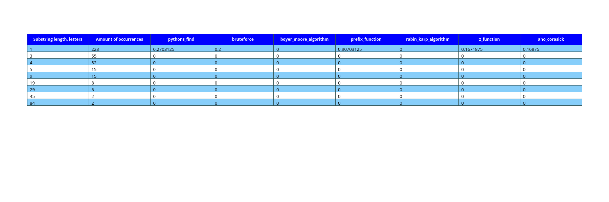

Как мы видим, тестируемые алгоритмы практически не занимают память, кроме расходов на сохранение списка с найденными вхождениями, это может значить, что алгоритмы реализованны корректно, с точки зрения тестирования по времени, т.е. никакой дополнительной "машинарии" с памятью алгоритмы не совершают.

---

Давайте теперь проведем сравнительную характеристику алгоритмов на основе проведенных нами тестов и объясним полученные результаты.
Как было обещано ранее, мы сейчас приведем сравнительную таблицу результатов тестирования на фиксированной длине текста с различными длинами подстрок и проанализируем ее.

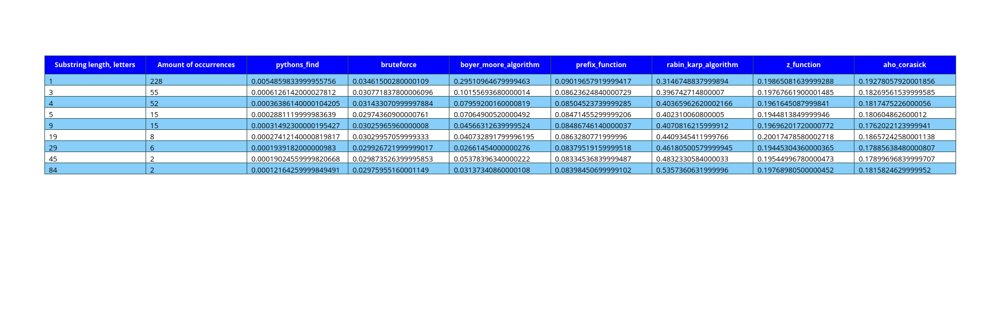

Из таблицы мы видим следующую закономерность:

Сразу видно, что неоспоримо лидирует стандартный алгоритм find, это имеет место по следующим причинам: встроенные алгоритмы в большинстве случаев написаны лучше, также могут быть изначально скомпилированны, что существенно ускоряет их исполнение.

Если длина подстроки больше четырех символов, то быстрее всех работает алгоритм Грубой силы, затем по увеличению продолжительности времени идут: Бойер-Мур, Кнута-Морриса-Пратта, Ахо-Корасик, Z-функция, Рабина-Карпа.

На средних длинах (в таблице этому соответствует длина подстроки три символа) быстрее всех работает алгоритм грубой силы, далее идут: Кнута-Морриса-Пратта, Бойера-Мура, Ахо-Корасик, Z-функция, Рабина-Карпа;
а на кратчайшей длине подстроки (один символ) алгоритмы Боэра-Мура и Рабина-Карпа показывают самое продолжительное время.

Hash- функция Рабина-Карпа в большинстве случаев работает медленнее. Дело все в том, что эта функция выполняет более «тяжелые» операции: побитовые сдвиги, а значит, она будет работать дольше.

Из этой таблицы можно сделать следующий вывод: на больших длинах подстрок для увеличения быстродействия следует пользоваться алгоритмом Боэра-Мура, а на маленьких и алгоритм грубой силы даст неплохие результаты.

---

Теперь сравним быстродействие алгоритмов на фиксированной длине подстроки.
В силу полученных результатов, а именно того, что все зависимости на реальном тексте линейны, можно сравнить быстродействие алгоритма по значению в одной ненулевой точке.

В качестве подстроки использовалась строка "rry"

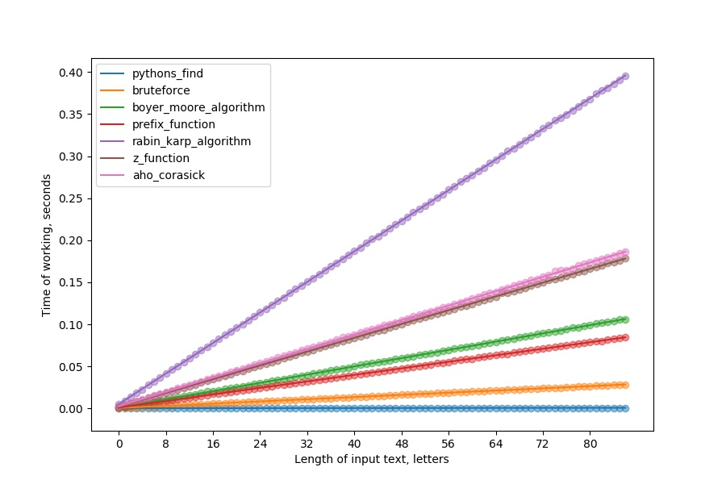

Таким образом, на фиксированной длине подстроки быстрее всех работает алгоритм грубой силы, затем в порядке увеличения продолжительности времени идут: Кнута-Морриса-Пратта, Бойера-Мура, Ахо-Корасик, Z-функция, Рабина-Карпа;
Но мы тестирование проводили на длине подстроки три символа.

Из предыдущей таблицы видно, что Боэр-Мур работает тем быстрее, чем больше длина подстроки, а автомат и алгоритм Z-функция работают в среднем одно и то же время.
Поэтому, в среднем получается следующая символическая таблица, отражающая быстродействие алгоритмов:

| Алгоритмы |
| :---: |
| Кнута-Морриса-Пратта |
| Алгоритм грубой силы |
| Алгоритм Бойера-Мура |
| Z-функция |
| Ахо-Корасик |
| Алгоритм Рабина-Карпа |

Результаты по памяти.

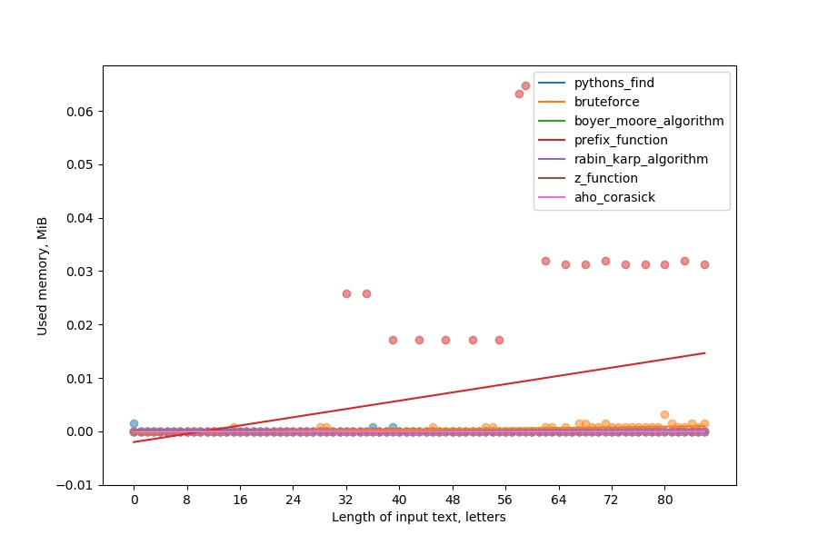

---

Ниже приведены графики для подстрок большей длины:

В качестве подстроки испольовался текст из **`data/Texts/Normal/_substring_for_ex_50`** (50 символов)

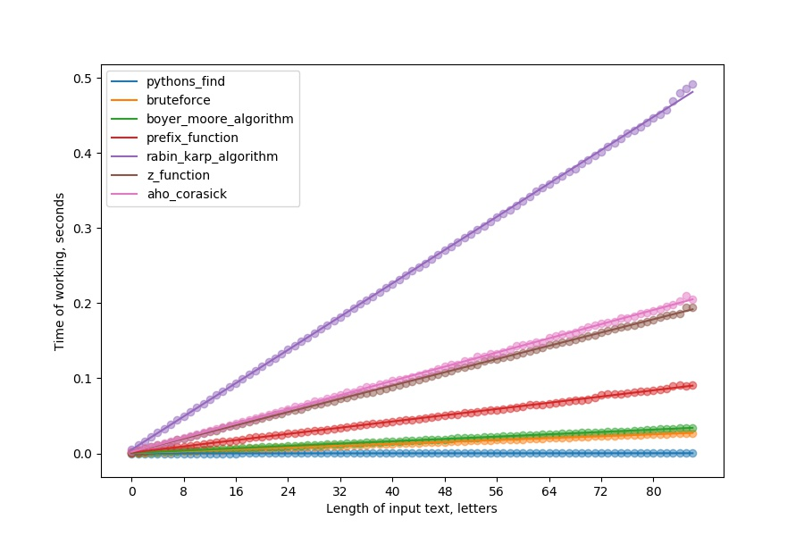


В качестве подстроки испольовался текст из **`data/Texts/Normal/_substring_for_ex_100`** (100 символов)


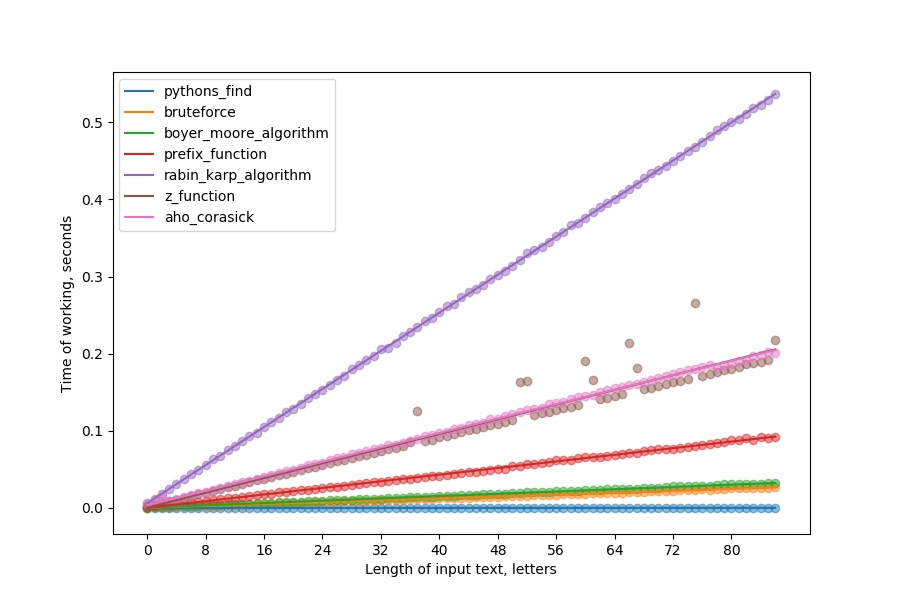


---

Tеперь привдем резальтаты, где для передачи данных использовались __list__.

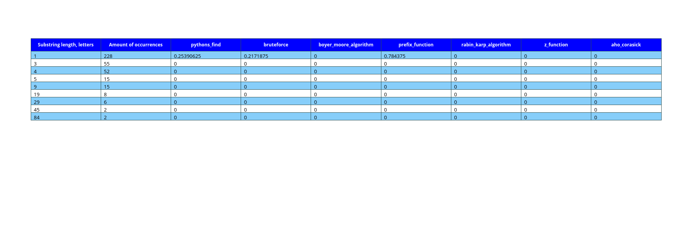


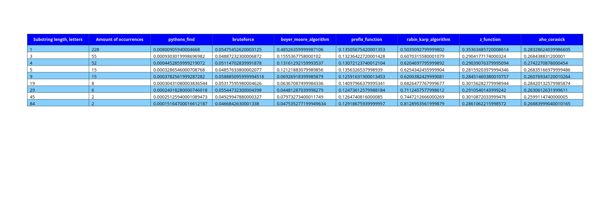


В качестве подстроки использовалась строка "rry"

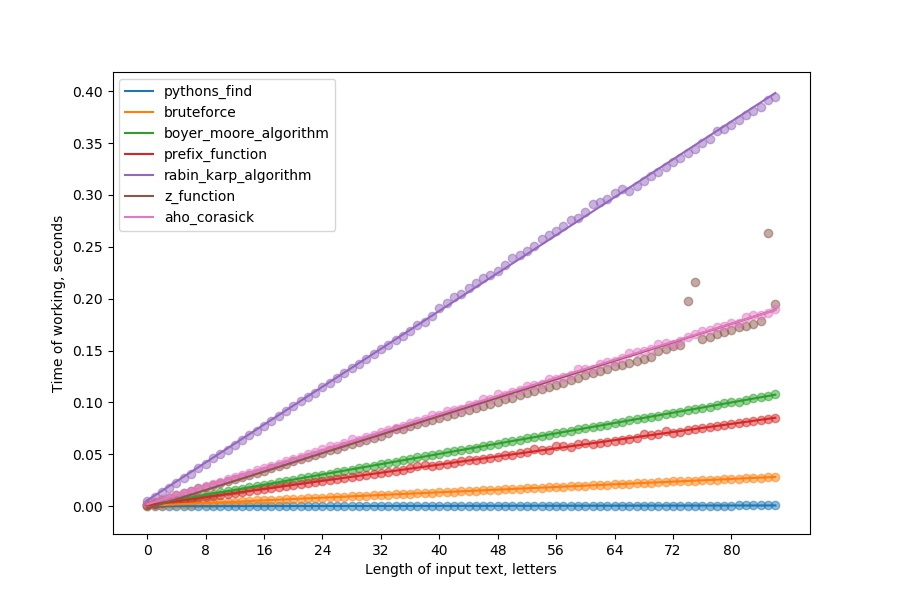


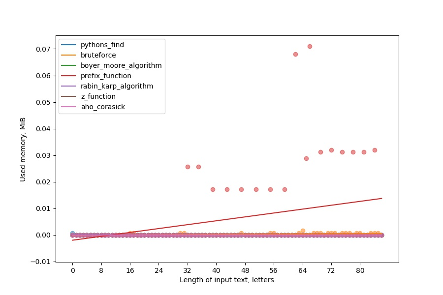

---

Ниже приведены графики для подстрок большей длины:

В качестве подстроки испольовался текст из **`data/Texts/Normal/_substring_for_ex_50`** (50 символов)

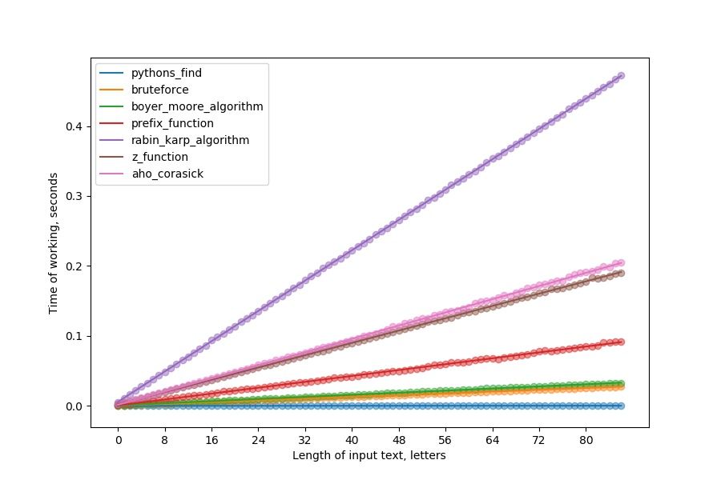


В качестве подстроки испольовался текст из **`data/Texts/Normal/_substring_for_ex_100`** (100 символов)


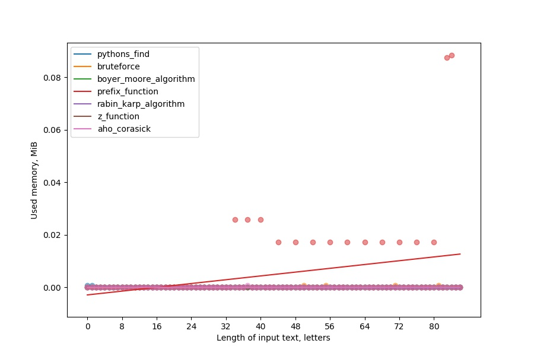

Как можно заметить время исполнения немного увеличилось, а исполльзование памяти уменшилось.
Это объясняется тем, что в **list** используются ссылки на данные, т.е. они хранятся на куче, а **tuple** хранит данные на стеке, и каждый раз копирует данные, однако, в стеке добраться до данных можно быстрее, поэтому tuple и работает быстрее. 
---

## Оценим сложность каждого из алгоритмов в лучшем и худшем случаях.

Возьмем длину подстроки как **M**, длину строки – **N**, учитывая, что **M <= N**.
Текст и подстрока будут худшим случаем, если алгоритм выполняет максимально возможное количество операций. И наоборот, лучшим случаем, если алгоритм выполняет минимально возможное количество операций.

### Для алгоритма грубой силы:

В лучшем случае первый символ подстроки не совпадет, тогда сместим. Если это всегда будет повторятся, то алгоритм выполнит минимальное количество действий. Их число равно: **N - M + 1**.
В худшем случае - число вхождений подстроки в строку максимально, тогда будет совершено максимальное колличество сравнений. Число сравнений будет равно: **M \* (N - M + 1)**.
Поэтому график будет лежать между этими прямыми.

### Для алгоритма Рабина-Карпа:
Был использован алгоритм, в котором для пересчета нужно добавить и вычесть некоторое значение; вычисление этого значения функции, как и сравнение двух чисел.
Тогда, в лучшем случае вхождений подстроки не будет, следовательно, функция выполнит операций: **2N**.
В худшем случае, так же как для алгоритма грубой силы, подстрока будет входить максимально возможное количество раз, число операций: **2N + M\*(N - M + 1)**.

В лучшем случае алгоритм грубой силы работает быстрее, чем алгоритм Рабина-Карпа, в худшем случае та же ситуация.
В итоге, в среднем, алгоритм Рабина-Карпа работает дольше, чем грубой силы.

### Для алгоритма Ахо-Корасик:
Алгоритм сначала выполняет построение суффиксного дерева, затем выполняет всегда ровно **N** действий. Поэтому, этот алгоритм всегда работает одинаковое время, не считая построения дерева.

