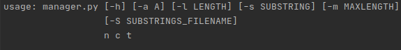
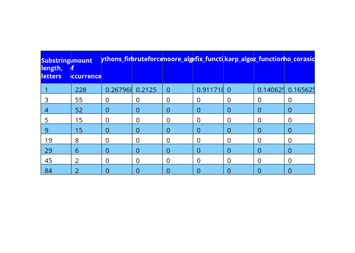
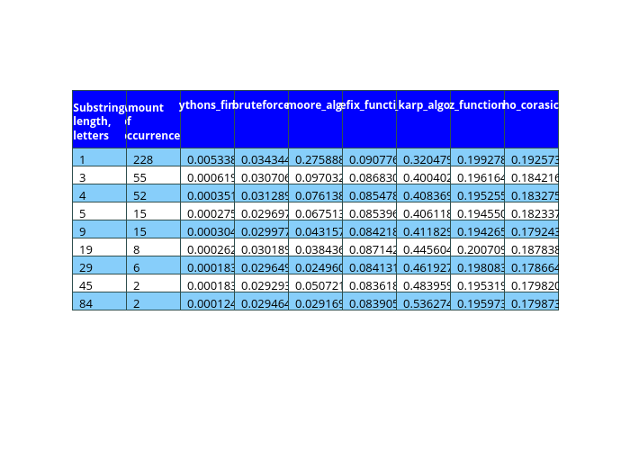
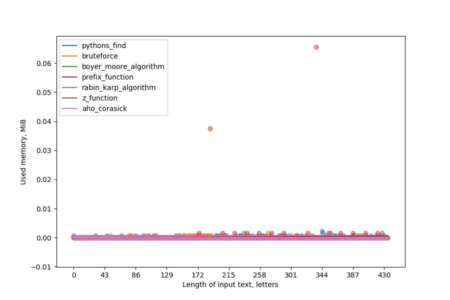
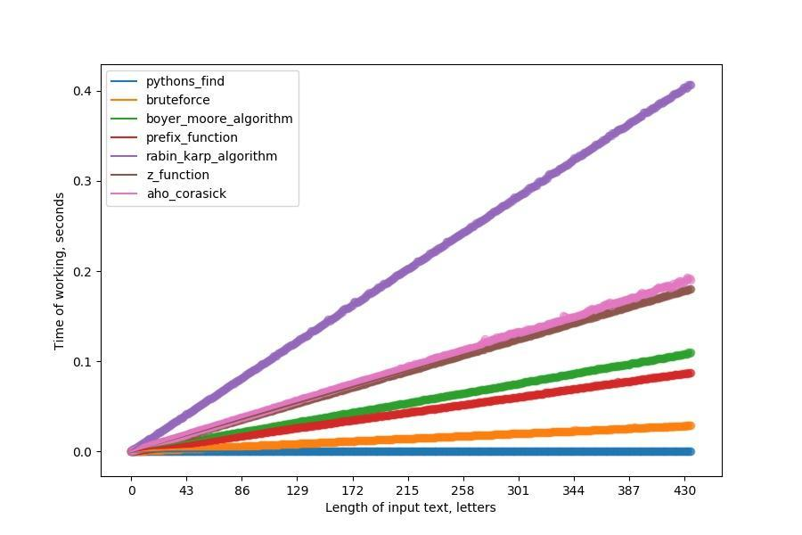
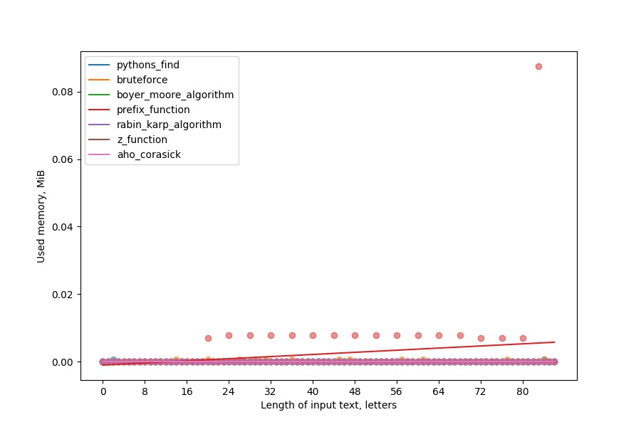
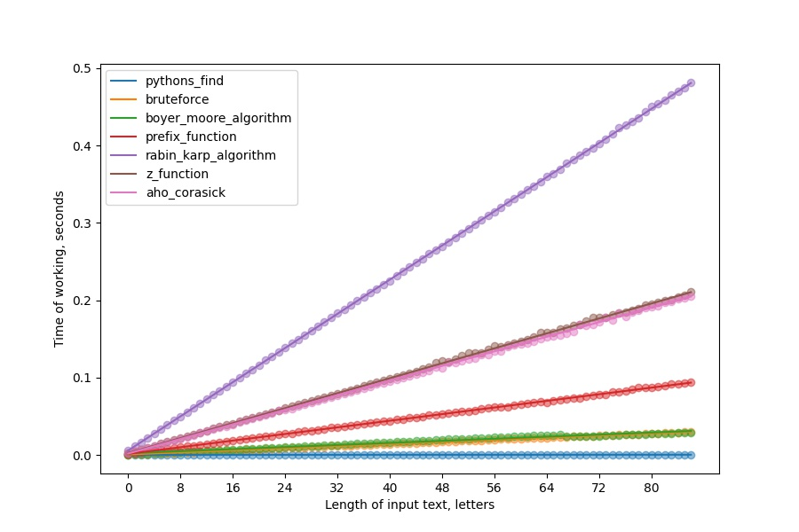
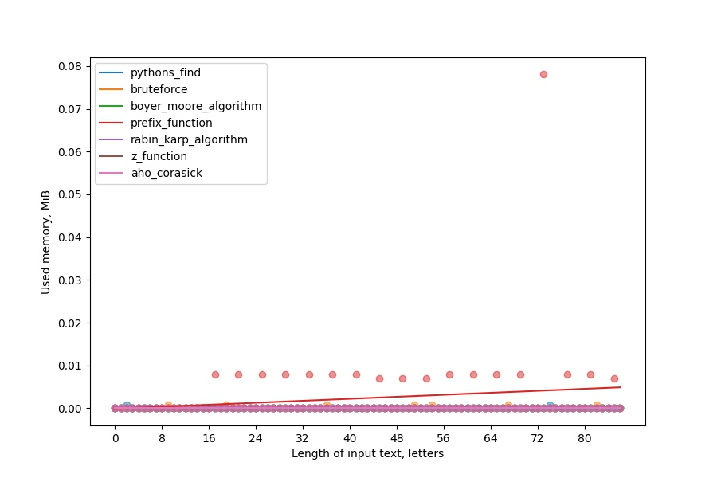
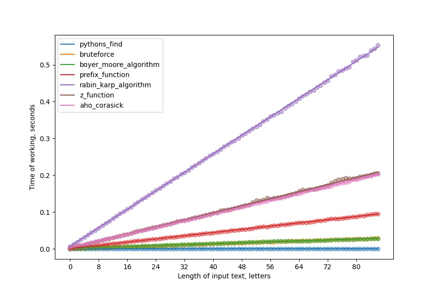

# SubstingSearchEx

# Содержание

1. [Постановка задачи](#постановка-задачи)

1. [Методика тестирования](#методика-тестирования)

2. [Параметры вычислительного узла](#параметры-вычислительного-узла-на-котором-выполнялось-тестирование)

3. [Описание тестируемых алгоритмов](#краткое-описание-тестируемых-алгоритмов)

4. [Результаты](#результаты-измерений)


# Постановка задачи

Реализовать несколько алгоритмов поиска подстроки в строке и сравнить их по производительности, использованию памяти.

 # Методика тестирования

## Проводимые тесты:

1. Используется короткая подстрока и различные длины текстов.

2. Используется весь текст и подстроки с различными длинами и количеством вхождений.

## Схема использования:

 
 


 Тестирование производится одной из команд, например:

  - ### Тестирование первой части

 ```bash
 python3 manager.py 1 5 "./data/Texts/Normal/INP_TEXT" -a "bruteforce" -a "boyer_moore_algorithm" -a "prefix_function" -a "rabin_karp_algorithm" -a "z_function" -a "aho_corasick" -m 2 -s rry
 ```
**n** - номер проводимого эксперимента (1);

**c** – количество запусков теста (5);

**FILENAME** – имя файла с текстом, в котором будет проводиться поиск ("./data/Texts/Normal/INP_TEXT");

**A** - название тестируемого алгоритма. Названия перечисляются через `-a` в том виде, в котором они приведены в примере. По умолчанию (без флагов `-a`) тестируется **Build-in find**.

**MAXLENGTH** – 0.01% от максимальной длины текста (2);

**SUBSTRING** – искомая подстрока ("rry");

Этот пакетный файл работает следующим образом: он генерирует числа от 2 до параметра **MAXLENGTH** включительно (если это число четное и исключительно, если оно нечетное) с шагом 2, и умножает число на 5000. Полученное число – количество символов, которые будут прочитаны от начала текста. Затем **`manager.py`** запускает модуль **`src/data_loaders/data_best.py`**, который делит текст и возвращает **list** данных для алгоритма. Результаты тестирования обрабатываются **`src/statiscian/simple_statiscian.py`**. Графики сохраняются в **`results`**.


- ### Тестирование второй части

```bash
 python3 manager.py 2 5 "./data/Texts/Normal/INP_TEXT" -a "bruteforce" -a "boyer_moore_algorithm" -a "prefix_function" -a "rabin_karp_algorithm" -a "z_function" -a "aho_corasick" -l 43000 -S "./data/Texts/Normal/Substrings.txt"
 ```

**n**, **c**, **FILENAME**, **A** аналогично.

**LENGTH** – сколько символов текста нам нужно прочитать от начала;

**SUBSTRINGS_FILENAME** – имя файла с подстроками, поиск которых будет осуществлен.

Этот пакетный файл работает следующим образом: он считывает из файла **SUBSTRINGS_FILENAME** очередную строку, запоминает число, записанное в начале строки, все остальное (исключая ведущие пробелы) считается подстрокой. Затем для каждой подстроки вычисляется колличество вхождений и ее длина, результат записывается в **`data/Text/Normal/substring_*`** Опять же, если какой-нибудь файл с таким именем уже будет существовать, он будет просто-напросто перезаписан.

# Параметры вычислительного узла, на котором выполнялось тестирование

 - ### Операционная система: 
    - **Ubuntu 20.04.1 LTS (Focal Fossa)**
 - ### Процессор: 
    - **Intel i7-8550U**. 
    - Максимальная тактовая частота с технологией Turbo Boost 4.00 GHz
    - Базовая тактовая частота процессора 1,80 GHz
 - ### Оперативная память 
    - **8 ГБ** встроенной памяти DDR4

Все тесты проводились в отдельном терминале (tty2) вне графических сессий (Wayland/i3) и после перезагрузки компьютера, поэтому нагрузки на процессор, которая могла существенно повлиять на результаты, со стороны других приложений не было.

# Краткое описание тестируемых алгоритмов

## Тестируемые алгоритмы

 - Поиск грубой силой (Bruteforce)
 - Поиск с использованием Hesh-функции:
    - Hesh-функция Рабина-Карпа
 - Поиск с помощью алгоритма Бойера-Мура
 - Поиск с использованием префикс-функции:
    - Алгоритм Кнута-Морриса-Пратта
    - Z-функция
 - Алгоритм Ахо-Корасик

## Оценки сложности алгоритмов взяты с сайтов [e-maxx](https://e-maxx.ru/algo/) + [neerc.ifmo.ru](https://neerc.ifmo.ru/wiki/index.php?title=Поиск_подстроки_в_строке):
 
 - Рабина-Карпа 
    - O(length(t)+length(p))
 - Бойера-Мура 
    - O(length(t)*length(p))
 - Кнута-Морриса-Пратта  
    - O(length(t)+length(p))
 - Z функция
    - O(length(t)+length(p))
 - Ахо-Корасик 
    - Препроцессинг O(length(p)) и O(length(t)) на один запрос.
 - Bruteforce 
    - O(length(t)*length(p))

 Все модули, реализующие алгоритмы, состоят из следующих частей, например, для bruteforce: 

```python
def performance_testing(data: Sequence, tests_count: int):
    ...
    for batch in data:
        ...
        for _ in range(tests_count):
            performance_memory, vals = memory_usage(
                (bruteforce, (batch[0], batch[1])),
                retval=True
            )
            ...
            memories_of_batch.append(
                max(performance_memory) - min(performance_memory)
            )
        ...
    return results_times, results_memories, occurrences
```
Функция *performance_testing* принимает на вход:
 -  **data** - это может быть как **list**, так и генератор состоящий из пар **(подстрока, текст_для_поиска)**
 - **test_count** - это колличество раз, сколько будет тестироваться алгоритм. Полученные результаты усредняются.

 При вызове *performance_testing*, роизводятся следующие действия:
 1. Функция [*memory_usage*](https://github.com/pythonprofilers/memory_profiler) вызывает алгоритм и замеряет память занимаемую интерпретатором с начала его исполнения. Затем возвращает значения памяти и значения, возвращаемые алгоритмом.
 2. В коде алгоритма замеряется время работы алгоритма


```python
def bruteforce(pattern: str, query: str):
    print(end='')
    ...
    start = perf_counter()
    ...
    end = perf_counter()
    return result, end - start
```
*print(end='')* нужна, чтобы память замерялась точнее.

### Реализации конкретных алгоритмов можно найти в `src/algorithms/*`.

# Результаты измерений

Все эксперименты проводились с предватительным запуском на тех же данных.

Ниже привдена таблица с результатами по памяти для подстрок **`data/Texts/Normal/Substrings.txt`**



Как мы видим, тестируемые алгоритмы практически не занимают память, кроме расходов на сохранение списка с найденными вхождениями, это может значить, что алгоритмы реализованны корректно, с точки зрения тестирования по времени, т.е. никакой дополнительной "машинарии" с памятью алгоритмы не совершают.




В качестве подстроки использовалась строка "rry"





В качестве подстроки испольовался текст из **`data/Texts/Normal/_substring_for_ex_50`** (50 символов)





В качестве подстроки испольовался текст из **`data/Texts/Normal/_substring_for_ex_100`** (100 символов)



